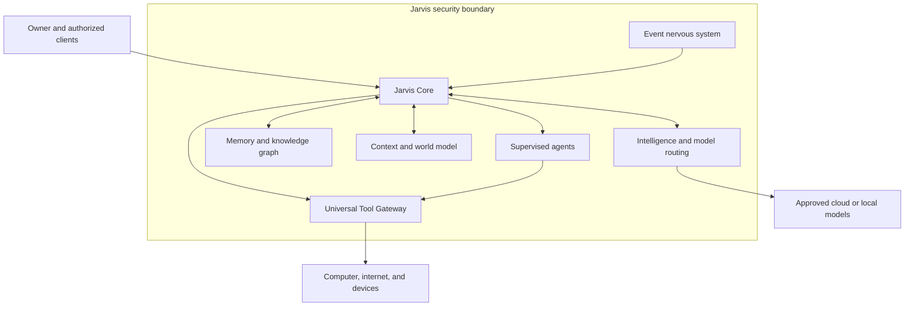

# Project JARVIS — Master Definition v0.1

**Status:** FROZEN — owner-directed product and architecture baseline  
**Owner:** Vaishnav Sawant  
**Baseline date:** 2026-09-01 UTC  
**Document ID:** JARVIS-MD-0.1  
**Current generation:** J0 — Jarvis Foundation  
**Source of authority:** The owner's Master Definition supplied in this conversation.  
**Implementation status:** This document records requirements and acceptance criteria. It is not evidence that J0 or any runtime capability has been implemented, tested, deployed, or secured.

> **JARVIS is the system. AI models are replaceable brains used by JARVIS.**

## 1. Purpose and freeze boundary

Build a private, owner-controlled personal AI operating system that can understand the owner, remember relevant information, reason, plan, communicate naturally, use tools, operate connected systems, coordinate specialized AI agents, monitor events, and progressively automate parts of the owner's digital and physical world.

“Personal AI operating system” describes the coordinating application and services. It does not require replacing a device's operating system.

The purpose, ownership commitments, system boundaries, capability families, control model, and J0–J15 roadmap below are the frozen direction. They govern future features, architecture decisions, database choices, model choices, device integrations, and agents.

Freeze does not mean that every capability ships in J0. It does not select a programming language, framework, database vendor, graph database, model provider, hosting service, hardware platform, or paid service. Those choices require implementation decisions consistent with this baseline.

Sections 2–17 normalize the owner's supplied definition into identifiable requirements without claiming implementation. Sections 18–22 supply engineering guidance, acceptance criteria, and change procedures derived from that definition. Guidance that resolves an unsettled implementation detail must be recorded in an Architecture Decision Record (ADR); it must not silently change the frozen intent.

## 2. Ownership and continuity

**OWN-01 — Owner control.** The owner must ultimately control:

| Asset | Required control |
| --- | --- |
| Source code | Inspect, maintain, version, and move Jarvis-owned source |
| Identity and configuration | Retain Jarvis identity and settings independently of model providers |
| Conversation history | Inspect, export, and delete retained conversations |
| Long-term memory | Inspect, correct, export, and delete stored memory |
| Knowledge graph | Retain entities, relationships, and their provenance |
| Files and documents | Control storage, access, export, and deletion |
| Agent definitions | Inspect identities, instructions, capabilities, and lifecycle |
| Automation rules | Inspect, enable, disable, change, and export workflows |
| Permissions | Grant and revoke authority; inspect effective permissions |
| Audit history | Inspect important activity and enforce its retention policy |
| Device registrations | Enroll, inspect, restrict, and revoke devices |
| Project information | Preserve architecture, decisions, repositories, tasks, and progress |
| Encryption keys | Control custody, authorized access, recovery, and rotation |
| Backups | Control destinations, retention, restoration, and access |

**OWN-02 — Model independence.** Changing an AI provider must not destroy Jarvis's identity, memory, projects, conversations, permissions, knowledge, or workflows. Provider-specific conversation IDs, hosted agent objects, embeddings, or caches must not become the only recoverable form of important Jarvis state.

**OWN-03 — Minimum disclosure.** External AI providers receive only the minimum context necessary for an approved intelligence task.

**OWN-04 — Local option.** Long-term local AI and offline operation must remain possible so cloud models can become optional. J0 must preserve this boundary even though full local operation belongs to J13.

Ownership of Jarvis-owned assets does not imply ownership of third-party model weights, provider services, or dependencies. Dependency rights and portability must be evaluated when they are selected.

## 3. Master architecture

**ARC-01 — Central coordination.** Jarvis Core coordinates intelligence, memory, current context, agents, events, and tools.

**ARC-02 — Security everywhere.** Identity, authorization, privacy, encryption, audit, and emergency controls surround every component and every trust boundary. Security is not a final step after an action.

**ARC-03 — One action boundary.** Agents and Core request external operations through the Universal Tool Gateway. Model output is a proposed action, not authority to execute.

The security boundary is logical: local components and a private server can occupy separate physical trust zones. Deployment across those zones must preserve the same controls.

## 4. Jarvis Core

**CORE-01 — Coordination loop.** For each request or event, Core must determine:

1. Who is asking, and on whose behalf?
2. What does the user want?
3. What current context is relevant?
4. Which memories may be retrieved?
5. Which eligible model should handle the intelligence task?
6. Does a supervised agent need to participate?
7. Which tools are required?
8. What permissions apply?
9. How risky is the proposed action?
10. Is additional verification or owner approval required?
11. Was the action actually successful?
12. What information, if any, should be remembered afterward?

Core must distinguish requested, prepared, approved, attempted, successful, failed, cancelled, and uncertain outcomes. A model's statement that a task succeeded is not sufficient evidence that it succeeded.

## 5. Intelligence system

**INT-01 — Separate capabilities.** Jarvis supports several forms of intelligence rather than one undifferentiated prompt.

| Capability | Intended responsibility |
| --- | --- |
| Conversation intelligence | Natural-language interaction |
| Reasoning intelligence | Complex problem solving and decision analysis |
| Planning intelligence | Goals, tasks, dependencies, and progress |
| Research intelligence | Search, comparison, verification, synthesis, and maintained research |
| Coding intelligence | Repository understanding, code creation, tests, and debugging |
| Visual intelligence | Screenshots, camera inputs, documents, and interfaces |
| Predictive intelligence | Patterns and possible future problems, with uncertainty |
| Simulation intelligence | Evaluate possible actions before execution |
| Emotional intelligence | Adapt communication to tone and context without asserting hidden mental states as facts |
| Meta-intelligence | Recognize uncertainty, limitations, and verification needs |

These are capability boundaries, not a requirement for ten separate services or ten separate models.

## 6. Multi-model brain

**MOD-01 — Replaceable adapters.** Core uses a Jarvis-owned model interface. Each selected provider or local runtime is an adapter behind it.

**MOD-02 — Routing criteria.** Routing considers privacy eligibility, task capability, quality, cost, speed, availability, and the need for verification. Privacy and authorization constrain the eligible models before optimization occurs.

| Task class | Possible routing behavior |
| --- | --- |
| Fast or simple | Small or fast model |
| Complex reasoning | Reasoning-capable model |
| Coding | Coding-capable model |
| Vision | Vision-capable model |
| Private task | Eligible local model |
| Critical decision support | Multiple models plus independent verification where policy permits |

These examples do not select products or guarantee quality. Agreement among models does not replace evidence, tool authorization, or owner approval. If no model satisfies the privacy policy, Jarvis must report that limitation rather than silently send the task elsewhere.

**MOD-03 — State outside the brain.** Canonical memory, identity, policy, project state, and workflow state remain owned by Jarvis. Changing a model may change output quality or require derived indexes to be rebuilt; it must not erase canonical state.

## 7. Memory architecture

**MEM-01 — Memory families.** Jarvis must represent these nine kinds of memory, even if some share a physical store initially.

| Memory | Purpose | Example |
| --- | --- | --- |
| Working | Temporary information for the current interaction | Currently debugging authentication |
| Conversation | Full history where retention is enabled | Retained owner–Jarvis exchanges |
| Personal | Long-term information and preferences the owner explicitly wants retained | Preferred communication style |
| Project | Architecture, decisions, repositories, deployments, roadmap, bugs, previous work, documentation, and progress | Jarvis J0 state |
| Semantic | Extracted facts and knowledge | A project's documented runtime |
| Episodic | Events and their context | Deployment failed and was rolled back |
| Procedural | Preferred recurring work methods | Run tests before production deployment |
| Relationship | Appropriate information about contacts, teams, companies, and responsibilities | A team's responsible maintainer |
| Device | Registered computers, phones, servers, and smart-home systems | A revoked laptop registration |

**MEM-02 — Retention control.** Working memory expires or is compressed after the task. Compression into retained memory remains subject to retention permission; it is not a way to bypass NEVER-STORE.

**MEM-03 — Provenance and correction.** Stored claims must support provenance, correction, and a distinction between confirmed fact and uncertain inference. Project and owner boundaries must remain meaningful during retrieval.

**MEM-04 — Owner rights.** Inspection, export, correction, and deletion must include applicable derived representations, such as summaries, graph facts, and search indexes. Backup and audit treatment must be made explicit in J0.4.

## 8. Jarvis Knowledge Graph

**KG-01 — Relationships.** The graph connects entities and information rather than merely retrieving disconnected paragraphs.

| Subject | Relationship | Object |
| --- | --- | --- |
| Owner | owns | Company A |
| Owner | created | Project X |
| Owner | works-with | Person B |
| Project X | repository | GitHub repository |
| Project X | deployed-on | Server |
| Project X | uses | PostgreSQL, in this illustrative example only |
| Project X | has-task | Bug #17 |
| Project X | decision | Architecture Decision #4 |

These entities are examples, not claims about actual registrations or a database selection for Jarvis. A dedicated graph database is not mandated by this definition.

**KG-02 — Evidence and access.** Relationships need source and temporal context, uncertainty where applicable, and the same access and deletion rules as the information from which they were derived.

## 9. Jarvis World Model

**WORLD-01 — Current representation.** Jarvis maintains a representation of known entities and their latest supported state: owner activity, device presence, project progress, service health, and agent activity. It can later expand into offices, homes, sensors, and physical systems.

**WORLD-02 — State quality.** State must distinguish observed facts, inferred state, stale observations, and unknown state. “Last observed online” does not establish “online now.” Illustrative labels such as “Server: Healthy” or “Security: Monitoring” must not appear as real status without evidence.

The knowledge graph represents relationships; the world model represents time-sensitive state. They may share underlying records without becoming interchangeable concepts.

## 10. Agent system

**AGT-01 — Supervision.** Jarvis remains the coordinator. Agents perform bounded specialist jobs and do not become independent, uncontrolled systems.

| Agent | Intended specialization |
| --- | --- |
| Jarvis Developer | Software development |
| Jarvis Researcher | Deep research |
| Jarvis Analyst | Data and decisions |
| Jarvis Secretary | Email, calendar, and administration |
| Jarvis Project Manager | Project coordination |
| Jarvis Security | Access and security monitoring |
| Jarvis Finance | Budgeting and financial analysis |
| Jarvis Automation Engineer | Workflows and integrations |
| Jarvis Device Controller | Computers and IoT |
| Jarvis Knowledge Manager | Memories and documents |

**AGT-02 — Bounded delegation.** Each running agent requires identity, task scope, effective permissions, permitted context, resource limits, lifecycle controls, and audit attribution. Delegation cannot increase the authority available to the parent task.

**AGT-03 — No unlimited proliferation.** Persistent agents require controlled creation and lifecycle policy. Agents cannot create unlimited persistent agents or independently grant permissions.

These are planned roles, not agents activated by freezing this document.

## 11. Event Nervous System

**EVT-01 — Event-driven behavior.** Events may include a new email, failed deployment, approaching meeting, overloaded server, changed file, GitHub push, overdue task, camera event, disconnected device, low battery, new message, or completed automation.

**EVT-02 — Disposition.** Jarvis evaluates whether to ignore, remember, notify, investigate, or act. Remembering follows retention rules; notification, investigation, and action follow permissions and operating modes.

Event delivery is preferred where available. Bounded polling may be necessary for systems that lack reliable event support; constant blind polling is not the intended design.

**EVT-03 — Events convey evidence, not authority.** Incoming event content cannot change security policy or grant itself an execution permission. Source identity, duplicate delivery, freshness, and failures must be handled by the event contract.

## 12. Action and Universal Tool Gateway

**TOOL-01 — Standardized operations.** Browser, terminal, files, GitHub, email, calendar, database, cloud, smart-home, and robot operations use the same controlled gateway boundary.

**TOOL-02 — Attributable execution.** Each operation records who requested it, which agent executed it if any, when it was attempted, its permitted argument representation, required and effective permissions, the result, and its failure or uncertainty state.

**TOOL-03 — Privacy-aware audit.** “Record arguments” does not require copying credentials or NEVER-STORE content into logs. Audit records use redacted summaries and safe references where necessary. J0.3/J0.4 must reconcile accountability with retention and secret handling.

**TOOL-04 — Enforced execution.** Permission and risk checks happen before tool execution and must still be valid when the operation begins. Model text, a claimed role, or a tool's description cannot authorize execution.

## 13. Permission architecture

**PERM-01 — Six permission levels.**

| Level | Name | Boundary |
| --- | --- | --- |
| P0 | Observe | Read-only access within the authorized data scope |
| P1 | Suggest | Recommend actions without executing them |
| P2 | Prepare | Prepare reviewable work; for example, draft an email without sending it |
| P3 | Execute Safe Actions | Execute pre-approved, low-risk operations within explicit bounds |
| P4 | Execute Sensitive Actions | Require additional verification or explicit approval according to policy |
| P5 | Critical Owner Actions | Never execute automatically; reserve for appropriate owner-controlled execution |

Examples that may fall under P5 include major financial transactions, credential or security changes, destructive operations, and high-impact physical actions. Exact classifications and thresholds belong to J0.3. Classify the actual operation and its context, not merely the tool name.

**PERM-02 — Scoped authority.** Permission levels describe allowed behavior, not a universal numeric clearance. A high permission level for one task does not authorize other resources, recipients, devices, projects, or data disclosures.

**PERM-03 — Sensitive preparation counts.** Preparing work in an external service may itself disclose information or change state; P2 does not automatically authorize every operation called a “draft.” Read-only access can also expose sensitive data.

**PERM-04 — P5 remains owner controlled.** The exact manual or owner-triggered execution mechanism will be defined in J0.3. A standing autonomous grant must not turn P5 into automatic execution.

## 14. Jarvis Constitution

This is a protected policy foundation. Its rules must be implemented as enforceable controls rather than relying on a model remembering a prompt.

| ID | Constitutional rule |
| --- | --- |
| CON-01 | Owner authority cannot be silently overridden. |
| CON-02 | Jarvis cannot grant itself additional permissions. |
| CON-03 | Jarvis cannot disable its own audit trail. |
| CON-04 | Jarvis cannot silently hide important actions. |
| CON-05 | Jarvis cannot modify protected security policies without owner authorization. |
| CON-06 | Agents cannot create unlimited persistent agents. |
| CON-07 | Critical operations require appropriate authorization. |
| CON-08 | Jarvis must distinguish confirmed facts from uncertain inference. |
| CON-09 | The owner can inspect, export, and delete stored information. |

The owner acts through authenticated control paths. Untrusted documents, emails, web pages, model responses, and tool results do not acquire owner authority by claiming to contain owner instructions.

## 15. Privacy architecture

**PRIV-01 — Privacy labels.**

| Label | Meaning |
| --- | --- |
| LOCAL-ONLY | Never sent outside owner-controlled infrastructure unless the owner explicitly authorizes a scoped exception. Credentials, encryption keys, and highly sensitive information belong here. |
| PRIVATE CLOUD | Encrypted Jarvis information the owner chooses to synchronize. |
| AI-ALLOW | Information that may be sent to approved AI providers when required for the task. |
| TEMPORARY | Context that automatically expires. |
| NEVER-STORE | Information usable for the session but not retained. |

**PRIV-02 — No implicit disclosure.** PRIVATE CLOUD does not imply AI-ALLOW. A confidentiality label and a retention label address different questions: where data may go and how long it may remain. J0.4 must represent both without using an expiry label to grant disclosure permission.

**PRIV-03 — Derived data.** Summaries, embeddings, graph relationships, traces, tool outputs, backups, and cached context can contain sensitive information. Their handling must follow the applicable source restrictions. Rephrasing information does not make it public.

**PRIV-04 — Infrastructure boundary.** “Owner-controlled infrastructure” needs an explicit deployment definition. A private server that processes plaintext has a different trust boundary from a server that stores only ciphertext; encryption terminology must not conceal that distinction.

**PRIV-05 — Secrets.** Tool connectors may need credentials for authentication, but model prompts must not become a credential transport. Custody, connector access, and any exceptions require a defined secret-handling policy.

## 16. Operating modes and emergency controls

**MODE-01 — Operating modes.**

| Mode | Intended behavior |
| --- | --- |
| Assistant Mode | Answer and advise |
| Copilot Mode | Prepare work and ask before executing |
| Autonomous Mode | Operate within predefined permissions |
| Focus Mode | Concentrate on one objective |
| Private Mode | Local processing and restricted memory/network behavior |
| Guest Mode | Restricted capabilities for another person |
| Safe Mode | Read-only operation with external actions disabled |
| Emergency Mode | Only predefined critical systems remain active |

Focus, privacy, identity, and execution modes may need to compose. J0.3 must define compatible combinations and precedence. A mode cannot independently grant additional authority, and Emergency Mode is not an unrestricted override.

**CTRL-01 — Independent emergency controls.** These controls must exist outside Jarvis's reasoning system and remain accessible when a model or agent hangs.

| Control | Intended effect |
| --- | --- |
| PAUSE | Stop new autonomous work |
| FREEZE | Stop agents |
| DISCONNECT | Stop external tool connections |
| SAFE MODE | Restrict operation to read-only behavior |
| REVOKE | Remove sensitive authorization tokens |
| SHUTDOWN | Terminate the Jarvis runtime |

**CTRL-02 — In-flight work.** Stopping new work does not undo an already completed external action. J0 must define cancellation, quiescence, outstanding-action reporting, and recovery. Physical systems later need their own validated safe-state behavior; cutting a process is not automatically a safe physical stop.

**CTRL-03 — Safe reads.** Safe Mode must define the eligible read paths. A read that triggers a remote effect or sends private information externally is not automatically safe.

## 17. Local and cloud architecture; development generations

**DEP-01 — Intended deployment roles.**

| Zone | Intended responsibilities |
| --- | --- |
| Owner devices / Local Jarvis | Local memory, encryption, device control, local AI, sensitive data |
| Owner-controlled private server | Optional synchronization, databases, agents, automations, and events |
| External AI providers | Approved intelligence requests with minimum permitted context |

Local devices and the private server communicate through authenticated, encrypted connections. External AI access is a controlled egress boundary. Replication does not remove the need to define which record is authoritative and how conflicts are resolved.

**ROAD-01 — Frozen generation sequence.**

| Stage | Objective |
| --- | --- |
| J0 | Foundation, architecture, security, and ownership |
| J1 | Jarvis Core and conversation |
| J2 | Memory and knowledge graph |
| J3 | Voice, vision, and multimodal interaction |
| J4 | Computer, browser, and file control |
| J5 | Projects, coding, and research |
| J6 | Agents and multi-agent orchestration |
| J7 | Email, calendar, and productivity integrations |
| J8 | Event system and proactive Jarvis |
| J9 | Advanced autonomy and simulation |
| J10 | Phone and multi-device Jarvis |
| J11 | Smart home and IoT |
| J12 | Personal world model and predictive intelligence |
| J13 | Local AI and offline Jarvis |
| J14 | Robotics and physical systems |
| J15 | Advanced Jarvis intelligence and continuous optimization |

This is a capability sequence, not a delivery-date or cost commitment. J0 defines interfaces and controls needed by later generations; it does not implement all of those generations. Local-provider compatibility begins in J0 even though full local operation is a later milestone.

## 18. Engineering guidance: J0 scope and work packages

The following breakdown makes the owner's J0 scope reviewable. The J0.1–J0.4 titles preserve the foundation, identity, policy, and data sequence already discussed. J0.5–J0.10 are proposed work-package identifiers, not claims of previously approved or completed milestones.

| Milestone | Deliverables | Evidence needed before marking complete |
| --- | --- | --- |
| J0.1 — Foundation, repository and architecture | Owner-controlled repository; component boundaries; development environment; baseline and ADR process; dependency and licensing inventory | A clean checkout runs documented checks; repository and ownership are verified |
| J0.2 — Owner Identity, Authentication & Device Trust | Owner bootstrap, login, device enrollment, sessions, recovery, biometric-ready authentication boundary, API identities, agent identities, trust levels | Demonstrated enrollment, authentication, revocation, expiry, and recovery; no voice or model claim used as sole identity proof |
| J0.3 — Security Policy, Permissions, Risk & Approval Engine | P0–P5; policy enforcement; risk classifications; bounded approvals; mode precedence; constitutional protections | Unauthorized, expired, revoked, modified, and out-of-scope requests are rejected |
| J0.4 — Private Data, Database, Encryption, Secrets & Storage Architecture | Canonical data model; privacy/retention rules; key custody; encryption; secret access; backup/export/deletion and restoration | Restricted data does not leak into logs or model requests; export and restore are demonstrated; deletion behavior is documented and exercised |
| J0.5 — Memory and knowledge contracts | Memory schema, provenance, project scoping, relationships, retrieval authorization, retention and correction semantics | Cross-project access and restricted-memory retrieval are denied in contract tests |
| J0.6 — Model abstraction and context boundary | Provider interface, capability registry, routing policy, budgets, failure behavior, local adapter contract | Two deterministic test adapters can be swapped without changing canonical Jarvis state; privacy-ineligible fallback is rejected |
| J0.7 — Universal Tool Gateway | Versioned tool declarations; authorization; execution lifecycle; secret references; effect and retry classifications | A harmless reference tool executes only through the gateway; bypass and unauthorized calls fail |
| J0.8 — Event and workflow contracts | Event envelope; source validation; correlation; deduplication; task lifecycle; cancellation and retry behavior | Duplicate, stale, malformed, and untrusted events cannot cause unauthorized effects |
| J0.9 — Audit and emergency controls | Attributed audit; redaction; integrity protection; independent controls; in-flight action reporting | Policy and control failures block affected actions; controls work when a test model or agent is unresponsive |
| J0.10 — Foundation integration and completion gate | Integrated vertical slice, threat review, reproducible setup, evidence register, unresolved-risk list | All J0 gates below pass with evidence against a specific source revision |

J0.9 names an integration work package: audit and emergency hooks must be included from the first executable slice, not postponed until late development.

### First executable slice

An authenticated owner submits a harmless request. Core retrieves permitted context, calls a replaceable test model, receives a proposed tool action, evaluates policy, obtains a bounded approval if required, executes a harmless reference tool through the gateway, records a redacted audit outcome, and stores only permitted memory. The same slice must demonstrate denial, provider failure, cancellation, and a stop control.

Use test adapters and reversible reference operations before enabling real external systems. J0 validates the framework; production conversation and integrations arrive in later generations.

### Deferred from J0 delivery

Full voice and vision interaction, unrestricted terminal/browser control, a production agent workforce, live email/calendar execution, advanced proactive autonomy, mobile apps, smart-home control, predictive systems, a complete local model stack, and robotics remain in their respective generations. No generation is removed by deferring it.

## 19. Engineering guidance: permanent contracts

These are contract requirements to refine during J0, not final database schemas or committed APIs.

| Contract | Information and behavior it must represent |
| --- | --- |
| Identity | Principal, principal type, owner relationship, device/session, trust, grants, expiry, and revocation |
| Request/context | Request and project scope, goal, actor, mode, permitted context, provenance, and retention restrictions |
| Memory/graph | Stable record identity, memory type, source, owner/project scope, privacy and retention facets, confidence, validity, correction, and deletion |
| Model invocation | Capability, eligible adapter, minimized context, output form, usage/cost, timeout, cancellation, and error |
| Tool declaration/invocation | Tool/version, input and output schema, targets, effects, permission needs, timeout, retry safety, and result evidence |
| Policy decision | Allow/deny/prepare/approval-needed result, evaluated policy version, reason, scope, and relevant constraints |
| Approval | Owner identity, concrete action and targets, immutable approved content, expiry, bounded use, revocation, and verification requirements |
| Event | Event ID/type/version, authenticated source, occurrence and receipt times, correlation, privacy label, payload reference, and replay handling |
| Agent/task/workflow | Parent task, delegated scope, lifecycle, dependencies, resource limits, checkpoint, cancellation, and outcome |
| Audit/control | Actor, decision, approved scope, attempted effect, result evidence, redaction, integrity, and control-state transitions |

Versioned boundaries must support migrations and reject unsupported or unsafe input. One process can initially implement several contracts; a logical boundary does not require a separate service.

## 20. Engineering guidance: J0 completion gate

All evidence below is **NOT YET COLLECTED** in this baseline. J0 remains open until implementation provides it. A written plan, mockup, or diagram alone cannot pass a runtime gate.

| Gate | Observable acceptance evidence | Primary requirements |
| --- | --- | --- |
| G01 — Reproducible ownership | Verified owner repository; clean setup; versioned migrations/contracts; dependency rights recorded | OWN-01, ARC-01 |
| G02 — Identity and isolation | Guest, unknown, expired, revoked, and wrong-project principals cannot access protected resources | PERM-02, MEM-03, CON-01 |
| G03 — Policy enforcement | Denied calls never reach tools; agents cannot grant authority; protected changes require authenticated owner authorization | ARC-02/03, TOOL-04, CON-02/05 |
| G04 — Bounded approvals | Changing action content, target, grant scope, expiry, or policy invalidates an approval when required; P5 cannot run autonomously | PERM-01/02/04, CON-07 |
| G05 — Privacy and retention | Synthetic sensitive markers stay out of forbidden provider requests, logs, indexes, and retained state; NEVER-STORE content is absent after its allowed session use | OWN-03, PRIV-01/02/03/05, MEM-02 |
| G06 — Portable brain | Swap deterministic adapters while preserving identity, conversation records, memory, permissions, project state, and workflows; refuse an ineligible fallback | OWN-02/04, MOD-01/02/03 |
| G07 — Execution integrity | The gateway attributes attempts and outcomes; retries of a reference side-effecting operation do not duplicate its effect; uncertainty is visible | CORE-01, TOOL-01/02/03/04 |
| G08 — Event safety | Spoofed, duplicate, out-of-order, stale, and malformed reference events cannot grant permission or repeat an already committed effect | EVT-01/02/03 |
| G09 — Independent controls | PAUSE, FREEZE, DISCONNECT, SAFE MODE, REVOKE, and SHUTDOWN act within documented bounds while a test model is hung; in-flight effects are reported | CTRL-01/02/03, MODE-01 |
| G10 — Audit integrity | Attempted tampering or disabled audit is detected; affected sensitive actions fail closed; secrets remain redacted | CON-03/04, TOOL-03 |
| G11 — Recovery and deletion | Export and restore into a clean environment; verify restored policy/key handling; exercise deletion and prevent deleted content from silently returning on restore | OWN-01, CON-09, MEM-04 |
| G12 — End-to-end release evidence | Integrated success, denial, failure, and cancellation paths pass; remaining limitations have owners and dispositions; no unresolved issue defeats a frozen invariant | CORE-01, ARC-02, CON-01–09 |

For each gate, record source revision, environment, scenario, expected outcome, observed outcome, evidence location, and reviewer. Passing test adapters does not establish production-provider compatibility; real adapters need their own integration checks when introduced.

## 21. Decision register and change control

### Frozen decisions

| Decision | Baseline |
| --- | --- |
| System identity | Jarvis persists independently of the model |
| Data ownership | Important state and recovery remain owner controlled |
| Security | Enforced across all layers, outside model discretion |
| External actions | Use the Universal Tool Gateway |
| Delegation | Supervised agents with bounded authority |
| Privacy | Minimum permitted context and explicit retention rules |
| Critical autonomy | P5 is never automatic |
| Emergency authority | Independent controls remain outside reasoning |
| Development order | Start with J0; preserve J0–J15 scope |

### Open implementation decisions

Repository location and visibility; implementation language and runtime; initial host and device targets; identity mechanism; policy representation; relational/document/vector/graph storage choices; encryption and key custody; backup destinations; providers and local runtimes; synchronization topology; event transport; operating limits; recovery targets; and detailed mode semantics remain open.

Choose them using explicit criteria: owner control, portability, privacy, enforceable security, operational simplicity, maintainability, reliability, measurable task quality, cost, and device constraints. Do not select a technology solely because a provider already hosts a convenient copy of the data.

### Change procedure

1. Identify the affected requirement IDs and the concrete problem.
2. Prepare an ADR or change request with alternatives, privacy/security effects, cost and portability effects, migration, rollback, and verification evidence.
3. Implementations consistent with the baseline may be decided within the owner's delegated project scope; routine details do not need repeated owner confirmation.
4. A change to frozen intent, constitutional controls, or protected security policy requires explicit owner authorization. Present the concrete change for review before adopting it.
5. Preserve v0.1. Publish a new version for an authorized baseline change, with a clear diff and rationale; do not silently rewrite the original.
6. Update affected tests, data migrations, documentation, and requirement mappings together.

### Feature and ADR intake template

Every proposed feature or architecture choice should answer:

- Which owner goal and requirement IDs does it serve?
- Which generation and milestone own it?
- Which canonical Jarvis records does it read or write?
- Which principals, projects, devices, and permissions are involved?
- Which privacy and retention rules apply, including provider disclosures?
- What side effects, approvals, audit entries, and stop behavior are required?
- How does it behave during provider failure, offline operation, cancellation, or partial success?
- How can it be exported, migrated, tested, and rolled back where possible?

## 22. Freeze record and current project truth

| Item | Status at freeze |
| --- | --- |
| Master product definition | Frozen as v0.1 by the owner's instruction in this conversation |
| Requirement identifiers and traceability | Defined in this document |
| J0 work-package breakdown and completion criteria | Prepared as engineering guidance |
| Actual Jarvis repository and source revision | Not verified in this task |
| Runtime, database, identity, policy, and encryption implementation | Not verified or created by this definition task |
| Provider connections, agents, devices, and automations | Not activated by this definition task |
| J0 completion | Not complete; evidence required by Section 20 |
| Immediate next engineering work | J0.1 — inspect any existing Jarvis code, establish the owner-controlled foundation, and record the first implementation ADRs |

**Changelog — v0.1:** Initial frozen baseline derived from the owner's supplied Master Definition. Preserves the purpose, ownership model, component architecture, ten intelligence capabilities, model independence, nine memory families, graph and world model, ten specialist agent roles, event system, gateway, P0–P5 levels, constitution, five privacy labels, eight modes, six emergency controls, local/cloud direction, and all sixteen J0–J15 generations. Adds explicit status, stable requirement IDs, engineering guidance, completion evidence, and change control.
