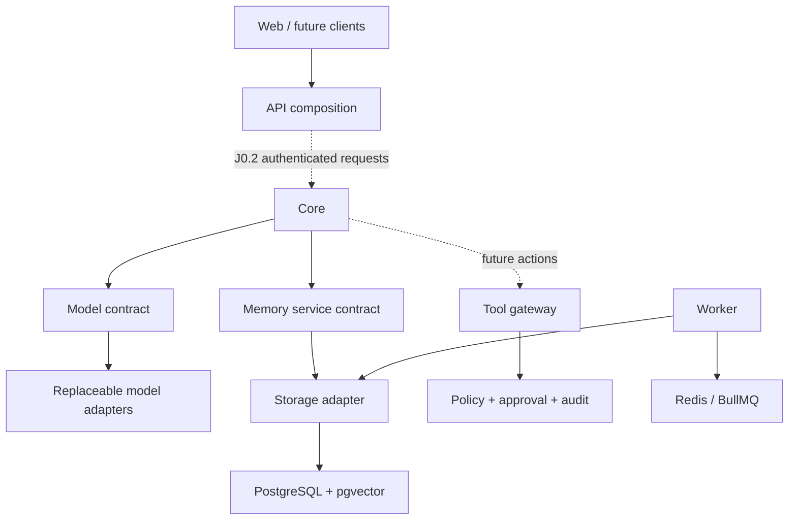

# J0.1/J0.2 system architecture

J0.3 extension (2026-09-02): authenticated security commands reuse this identity
foundation and add durable policy/risk/approval/authorization state. Only registered
synthetic tools are executable, through exact one-use permits. See
[J0.3 authorization](../security/j0.3-authorization.md). J0.4 remains paused.

Updated: 2026-09-02. Active implementation: TypeScript 0.3.0 with J0.2 identity. Contract schemas carry
`version: 1`; they are candidates for the J0.12 freeze, not a Foundation v1 GO.

Solid lines show implemented dependency boundaries; dotted edges mark disabled
runtime features. The web exposes health and a J0.2 passkey/device identity console;
its same-origin BFF signs requests to the identity API. Owner operations require
session/device proof and sensitive changes require fresh passkey approval. Core/
model/memory composition remains test-only. A recipient-bound delegated mock read
passes through the ToolGateway; no unauthenticated owner operations are shipped.
Worker jobs accept only a validated synthetic `foundation.ping`
envelope and write an encrypted completion event. There are no persistent agents.

## Package boundaries

| Package | Owns | Does not own |
| --- | --- | --- |
| core | Coordination through ports, privacy checks, model response validation | Provider SDK, database connection, UI |
| identity | Owner/subject types, passkey port/adapter, device-bound sessions, approvals, delegation, recovery | UI, SQL, model-chosen authority |
| security | Permissions, policy/approval ports, scoped secret leases | Agent-controlled authorization |
| memory | Memory record schema, owner/project scope, retention rules | SQL |
| knowledge | Graph entity/relationship ports | A chosen graph engine |
| models | Provider request/reply contract and local deterministic mocks | Canonical owner identity or memories |
| agents | Agent registration/task ports | An enabled agent runtime |
| tools | Tool contract and permission/approval/audit gateway | Direct unreviewed integrations |
| events | Event contract and development queue adapter exports | Authenticated external event ingress |
| audit | Validated minimal accountability records | Operational debug payloads |
| storage | PostgreSQL/Drizzle repositories, encryption, migrations | Domain orchestration |
| devices | Shared registration port and trust vocabulary; authentication composed in identity | Real device control or hardware attestation |
| config | Strict validated environment settings | Plaintext credentials |
| shared | Common schemas, identifiers, health, trace/log primitives | Business decisions |

Apps are composition roots. Packages import other packages through public
`@jarvis/*` entrypoints. TypeScript project references encode the graph; the
boundary checker rejects undeclared and prohibited imports. Core cannot import
storage, config, UI, provider SDKs or Node-specific APIs. `events` exports the
initial BullMQ implementation for composition roots; Core uses only its port.
This can later split into an adapter package without changing event envelopes.

## Data and privacy

PostgreSQL is the canonical development store. Domain schemas separate concerns;
Drizzle owns typed repository mappings while reviewed SQL owns migration history.
Memory and event content use AES-256-GCM with record-bound authenticated context.
IDs, project IDs, event kinds, times and minimal audit metadata remain queryable;
encryption does not conceal database traffic or metadata from the host operator.
The vector extension and model-labelled embedding table exist, but embedding
writes/retrieval are disabled pending memory/privacy gates.

Privacy and retention are separate axes. `local-only`, `private-cloud`, and
`ai-allow` specify processing destination. `persist`, `temporary`, and
`never-store` specify lifetime. An event's sensitivity does not override network
policy. Real provider adapters and credential-bearing tool integrations are
absent. Swapping the two mock providers leaves canonical records untouched.

## Deployment direction

J0.1 is local development: Node services on the host; PostgreSQL/Redis in Docker.
Later, the same interfaces can run on an owner-controlled Linux server behind
an authenticated TLS endpoint. Sensitive devices and key custody stay local.
Vercel remains an optional future web host; managed PostgreSQL remains an optional
storage adapter. Neither defines Jarvis identity or data formats. S3-compatible
objects and independently protected audit storage are separate future adapters.
