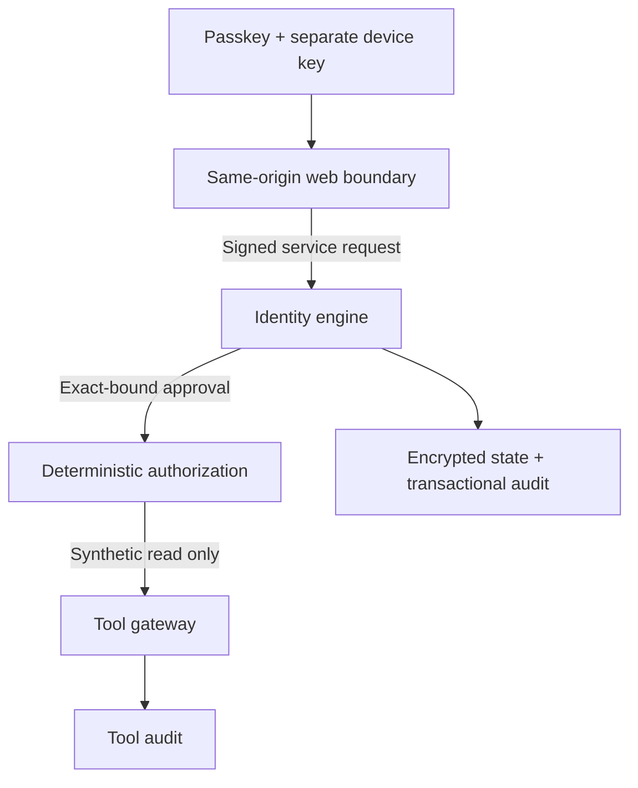

# J0.2 identity security foundation

Date: 2026-09-02. Scope: local development, one owner, synthetic mock tool only.
This implements the owner's identity milestone; it does not issue Foundation v1 GO.

## Trust boundary

The immutable `owner_<UUID>` belongs to Jarvis, not an email address, UI, device,
model provider or authentication vendor. One singleton row plus serialized
transactions prevents competing initial owners. The local installation claim
code is required for first enrollment; `npm run identity:bootstrap` displays it
only in an interactive local terminal. There is no email/password reset.

Core, models and future agents do not decide authentication. API input cannot
provide a trusted actor, assurance level, permission context or owner session.
Only verified domain code constructs that context. The old `IdentityService`
interface remains a non-instantiated compatibility port; a bare bearer-token
lookup must never replace `IdentityEngine` device-bound request verification.

## Passkeys are not device identities

The real verifier is `@simplewebauthn/server` 13.3.3 behind `PasskeyVerifier`.
Browser ceremonies use `@simplewebauthn/browser` 13.3.0. Verification checks
challenge, exact origin, RP ID, credential ownership, signature, user verification
and signature counter. Registration uses no attestation. Synced passkeys can have
zero counters; those are not hardware provenance or clone-detection guarantees.

WebAuthn user verification can be a biometric **or a device PIN**. Jarvis records
user verification, not a claim that it observed a fingerprint or face. Voice,
camera recognition, location hints and client-provided trust fields cannot grant
authority. A hardware security key may authenticate without proving A4.

Each browser profile separately generates a P-256 signing key. The private
CryptoKey is non-extractable and persisted in IndexedDB; public key and device ID
are registered in Jarvis. This is cryptographic possession, **not hardware-backed
attestation**. XSS or a compromised browser/OS can use a non-extractable key.
Clearing browser storage loses it; a synced passkey alone will not reconnect the
device. Re-enroll with a new key and owner approval, or use the recovery kit.

| Assurance | Implemented meaning |
| --- | --- |
| A0 | No verified owner/device authority; locked public interface |
| A1 | Temporary device or restricted-risk session; owner security state denied |
| A2 | Verified passkey and enrolled device possession; normal owner session |
| A3 | Fresh verified passkey plus device proof for one exact sensitive action |
| A4 | Reserved, not issuable; critical actions always denied |

Unknown enrollment is not trusted. Temporary approval lasts at most 15 minutes.
Trusted devices can inspect owner security state, but cannot manage identity.
Privileged devices may request sensitive identity actions with A3. The initial
device and recovery device are privileged; approving another as privileged is
explicit, signed and owner-authorized. Hardware-root is a reserved trust value,
not an enrollment option. Revoked keys cannot be reused; re-enrollment needs a
new device key and a new credential. Neither privileged trust nor a passkey is A4.

## Sessions, step-up and delegation

- Random 256-bit session tokens are stored only as hashes, inside encrypted state.
  The BFF keeps tokens out of JavaScript responses and uses an HttpOnly, Secure,
  SameSite=Strict cookie scoped to `/api/identity`. HTTPS is required remotely;
  this development origin uses the browser's localhost secure-context exception.
- Every meaningful owner request also signs a fresh server challenge with the
  registered device key. A copied cookie does not authorize an action. Challenges
  expire after two minutes and are consumed on failed verification as well as
  success. One owner transaction consumes each challenge at most once.
- Sessions have 15-minute absolute and five-minute idle deadlines, device/owner
  epoch binding, scopes and risk state. Every use rechecks expiry, revocation,
  device status and context. User-agent context changes or suspicious device
  posture downgrade authority. User-agent is spoofable risk context, not proof.
  No geography, surveillance, impossible-travel or behavioral classifier exists.
- A3 approvals expire after 90 seconds and bind owner, session, device, operation,
  canonical input digest, challenge and expiry. They are consumed once; A3 does
  not elevate the whole session. The stored WebAuthn assertion and public key let
  `verifyApprovalEvidence` check the signature independently. That verifies
  evidence integrity, not independent proof that a human understood the UI or
  that the included key belongs to the owner without a trusted enrollment chain.
- Sensitive identity actions require a privileged device as well as A3. Owner
  transfer and critical operations fail closed even after normal step-up; their
  A4/recovery ownership-change ceremony is deliberately not implemented.
- Agent, service, integration, tool and guest records have separate IDs/keys and
  explicit scope/resource allowlists, empty by default. A guest cannot become an
  owner by presenting a subject ID. Guest conversational login/roles are future
  work; restricted key-bound mock capability authentication works now.
- Delegations use independently random hashed tokens, recipient-key possession,
  one scope, one resource, fixed `jarvis.mock` audience, 1–900-second lifetime,
  owner epoch and issuing session/device. Parent logout, device revocation,
  recovery or expiry invalidates authority. No descendant delegation exists.
  Only `mock.read` is allowed; no repository/file/network operation is performed.

The BFF validates exact Origin and JSON content type, limits request size, ignores
client-supplied session tokens and signs the API request body with a dedicated
installation service key. API service proofs bind service ID, operation, body,
timestamp and nonce; durable replay checks reject repeats. Database/Redis
connections use explicit development credentials, not network location. These
are local installation services, not agents inheriting owner permissions.
Per-worker producer identity, mTLS, rotated remote service credentials and
authenticated external event ingress remain J0.3/J0.8 deployment work. The
existing worker only processes synthetic `foundation.ping` jobs.

## Storage and auditing

Migration 0002 adds `identity.root_owner`, devices, passkeys, sessions, subjects,
delegations, challenges, approvals, replay records and `audit.identity_events`.
It is additive and checksummed; 0001 is unchanged. Domain state uses AES-256-GCM
with table/record-bound context. Token hashes, public credential material and
security state are encrypted. No raw token, recovery key, private device key or
passkey private key is persisted in these ordinary tables.

PostgresIdentityRepository serializes identity mutations with a transaction-scoped
advisory lock and writes identity state plus security events atomically. Audit
failure rolls back the identity mutation. Authentication denials and challenge
consumption commit together, so rejected attempts do not become replayable.
Malformed/unsigned requests rejected at the HTTP boundary have safe status codes;
not every transport packet is a durable owner security event. Transactional
security events are visible through authenticated owner inspection. Publishing
them to general subscribers requires the J0.8 transactional outbox.

Runtime SQL privileges and triggers deny audit mutation and root ID replacement.
The database administrator can disable/drop controls. This is **not independently
immutable audit storage**, and a compromised application holding storage keys is
not confined by these controls alone. Off-host witnesses, external archive and
process/key isolation remain mandatory later gates. Tool audit uses the existing
gateway sink; uncertain external effects are not solved by a SQL transaction.

For this small single-owner foundation, encrypted identity maps are loaded under
one lock. Resource caps: 128 live challenges, 64 active sessions, 100 devices,
100 subjects. Expired challenges/service nonces are pruned; revocation tombstones
are retained. This is not a high-throughput or multi-tenant identity database.
Indexed scoped loading, retention maintenance and denial-traffic budgets need
J0.3/J0.4/J0.9 work before remote deployment. New identity vault entries are added
atomically without rotating existing database credentials or the master key.

## Offline identity recovery

On a privileged device with A3, create an encrypted identity package and separate
random 256-bit recovery key. Keep them offline in **separate places**, alongside
the expected owner ID. Downloading the package does not include its key. Creating
a new kit invalidates the previous generation in the active authoritative store.

Recovery verifies the package/key, owner ID, RP/origin and active generation;
registers a fresh passkey/device; retains the owner ID; increments authority epoch;
revokes previous devices, credentials, sessions, subjects, delegations and
approvals; consumes the kit; and records recovery events. A clean installation
also requires that installation's local claim code. It cannot know about newer
kits or revocations in an unavailable server/backup. Offline rollback/fork
detection therefore requires an external authority checkpoint in J0.10.

This kit restores **identity authority only**. It does not contain personal data,
the storage encryption key, integration credentials or complete audit history.
It is not a full backup and does not rotate the development vault/transport keys.
Never treat it as evidence of the user's worst-case disaster-recovery completion.
There is no email takeover fallback. Hardware/recovery-device combinations,
multi-party recovery, restore ordering, key rotation, independently witnessed
revocation and off-host disaster drills remain documented J0.10 requirements.
Remote erase of a lost/offline device cannot be guaranteed; server authorization
is revoked immediately on the next attempted request.

The development RP is `localhost`, origin `http://localhost:3000`. Passkeys are
origin/RP bound. Moving to a real domain requires a separately approved migration
ceremony; editing config does not silently transfer credentials or recovery kits.

## Verification and next gate

Unit/security fixtures generate genuine signed WebAuthn CBOR credentials and
assertions, not a stubbed verification boolean. PostgreSQL integration runs in
an exact generated disposable database and tests rollback, concurrent replay,
encrypted persistence, owner/audit mutation denial and recovery. Browser CI uses
Chromium's virtual authenticator to exercise the actual browser/API/database path.
It does not prove physical Touch ID/Face ID/hardware attestation interoperability.

J0.3 must generalize permission/risk/approval policy, emergency controls,
resource/rate budgets and policy administration before any powerful tool is added.
Full J0 additionally requires data sovereignty, independent immutable auditing,
host containment and complete disaster recovery. No real cloud/provider account
or production deployment is enabled by this milestone.

References: [SimpleWebAuthn server verification](https://simplewebauthn.dev/docs/packages/server),
[W3C Web Authentication](https://www.w3.org/TR/webauthn-3/).
